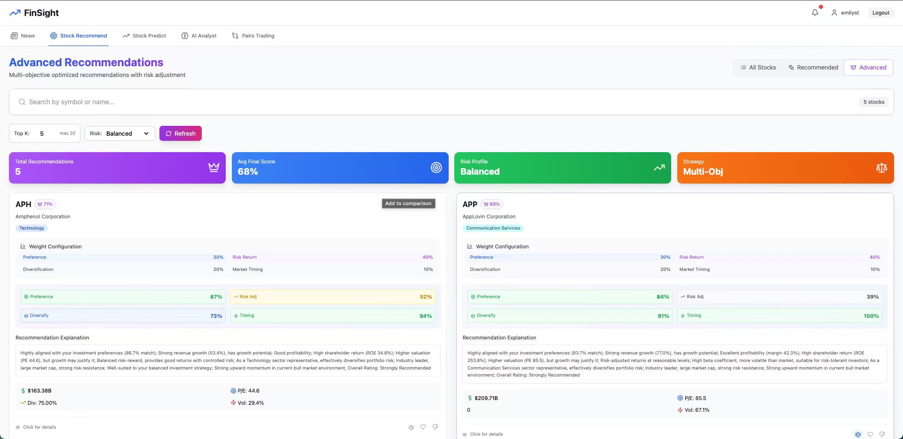
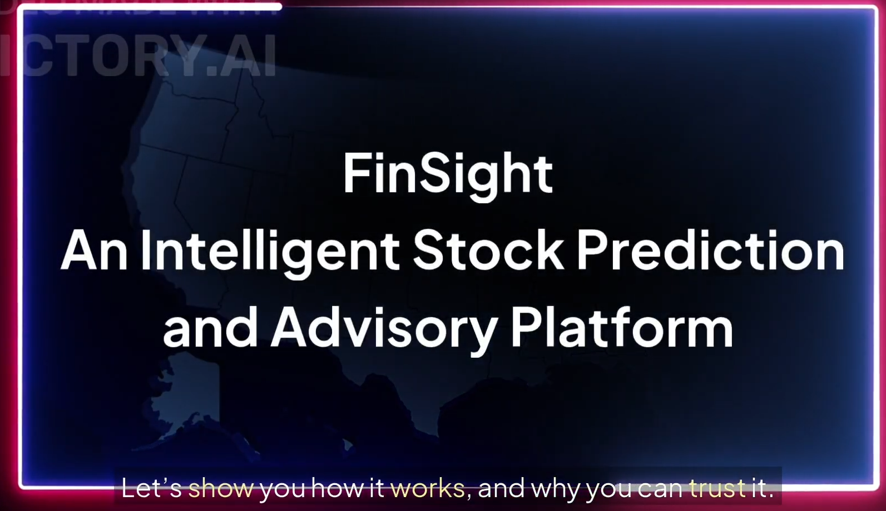
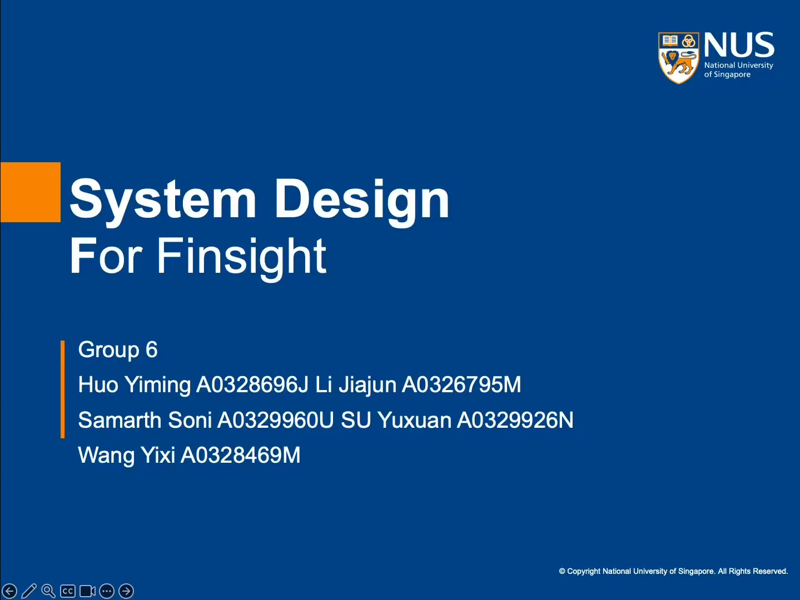

# FinSight: Intelligent Stock Predictionand Advisory Platform

---

## SECTION 1 : PROJECT TITLE
### FinSight: Intelligent Stock Predictionand Advisory Platform

---

## SECTION 2 : EXECUTIVE SUMMARY / PAPER ABSTRACT
At FinSight, we’ve tried to cover all fronts of data science that help a market participant get the big picture at a glance and act fast. We learn each user’s preferences and tailor what we surface: relevant news, an evolving list of interesting stocks, short-horizon predictions on the names that matter, and a specialised LLM that behaves like a personal financial research analyst — reading your docs, explaining its thinking, and showing its work.

All actionable items get value-added annotations: news sentiment tags from a finance-tuned classifier (e.g., FinBERT), a lightweight risk lens on stocks, and a projected stock movement view using deep time-series/recurrent models. For narrative answers, we use RAG so the LLM cites the exact passages it relied on. We emphasise explainability: clear reasoning traces, citations, and intuitive visuals — so a human can audit why a conclusion was reached and what would change it. This helps us in grounding responses in evidence and reducing hallucinations.

On the data side, we stream in news and filings continuously, parse the text, and maintain vector embeddings for users, news items, and tickers alongside the vectors we use for LLM retrieval. We then score relationships with standard similarity measures (cosine/inner-product) so the system can match “you-shaped” interests against fresh content and instruments quickly. This is classic vector search under the hood (FAISS/pgvector), but tuned for markets: fast nearest-neighbour lookups to power news recommendations, stock watchlists, and context retrieval for the LLM.

Operationally, we engineered the stack to be practical: automated ingestion and chunking of messy PDFs/docs, vector search to pull the right context quickly, and a lightweight serving layer that scales from our laptops to GPUs on the cluster. This collaboration grounds the project in real market workflows while giving us hands-on exposure to production-grade financial AI — where reliability, latency, and traceability matter as much as raw accuracy

---

## SECTION 3 : CREDITS / PROJECT CONTRIBUTION

| Official Full Name  | Student ID (MTech Applicable)  | Work Items (Who Did What) | Email (Optional) |
| :------------ |:---------------:| :-----| :-----|
| **Huo Yiming** | **A0328696J** | Full-stack stock recommendation system development<br/><br/>Stock Data pipeline & Vector architecture (MongoDB/PostgreSQL)<br/><br/>Create Basic Stock recommendation and Advanced stock recommendation service | e1553023@u.nus.edu |
| **Li Jiajun** | **A0326795M** | Led the overall system design and full-stack development<br/>Built frontend and backend infrastructures.<br/>Integrated MongoDB and PostgreSQL databases deployed on AWS EC2.<br/>Developed user authentication and RAG-based AI Financial Analyst modules. | jiajunli@u.nus.edu |
| **Samarth Soni** | **A0329960U** | Optimized LLM performance and enhanced knowledge base updates.<br/>Established standardized contribution and submission guidelines.<br/>Participated in the architectural design of the AI Analyst module.<br/>Contributed to comprehensive technical and project documentation writing. | samarth.soni@u.nus.edu |
| **SU Yuxuan** | **A0329926N** | Developed the News Browsing and Recommendation Module<br/>Implemented news ingestion<br/>Built the dual-vector recommendation system <br/>Integrated real-time user feedback updates for adaptive ranking and personalization. | E1554253@u.nus.edu |
| **Wang Yixi** | **A0328469M** | **Developed the stock forecasting module of the FinSight system.**<br/> **Utilized recommended tickers from the recommendation engine for prediction tasks.**<br/> **Implemented six forecasting models: Transformer, LSTM, Seq2Seq, ARIMA, LightGBM, and Prophet.**<br/> **Achieved accurate short-term stock trend forecasting across selected equities.** | e1547224@u.nus.edu |

---

## SECTION 4 : VIDEO OF SYSTEM MODELLING & USE CASE DEMO

[2025 FALL NUS ISS AIS07 IRS5001 GRP6 FinSight Promotion Video](https://www.youtube.com/watch?v=bolGMzWV9H4)



[2025 FALL NUS ISS AIS07 IRS5001 GRP6 FinSight System Demonstration](https://www.youtube.com/watch?v=etfMw8lXQlI)


---

## SECTION 5 : USER GUIDE

`Refer to appendix <Installation & User Guide> in project report at Github Folder: ProjectReport`

### Backend

```shell
# Create virtual environment
uv venv
source .venv/bin/ activate

# Install dependencies
uv pip install -e .
# (or pip install -e .)
# Running the Backend
uvicorn app.main:app --reload --port 8000
```

### Frontend

```shell
# 1) In this folder :
pnpm i
# 2) set backend endpoint ( optional ; default already localhost ):
echo 'VITE_BACKEND_BASE_URL =http ://127.0.0.1:8000 ' > .env

# 3) run
pnpm dev

# 4) quick restart
rm -rf node_modules pnpm -lock.yaml package -lock.json # optional clean
reboot
pnpm i
pnpm dev
```

### Database

- MongoDB: Stores news and optionally vector embeddings.
- PostgreSQL + pgvector: Stores user profiles, embeddings, and recommendations.

To connect, simply place finsight_keypair.pem in the project root. The program will automatically establish the SSH tunnel and access the databases.

### RAG Component Deployment

1. Deploy Ragflow locally: Follow the official guide at https://ragflow.io/docs/dev/build_docker_image

2. Run local LLM via Ollama:

   ```
   ollama run deepseek -r1:8b
   ```

3. Replace your Ragflow key: Add it to the .env file as:

   ```
   RAGFLOW_API_KEY =<your -key >
   ```

### Repository

https://github.com/jiajun-lab/FinSight_Frontend

https://github.com/jiajun-lab/FinSight_BackEnd

---
## SECTION 6 : PROJECT REPORT / PAPER

`Refer to project report at Github Folder: ProjectReport`


